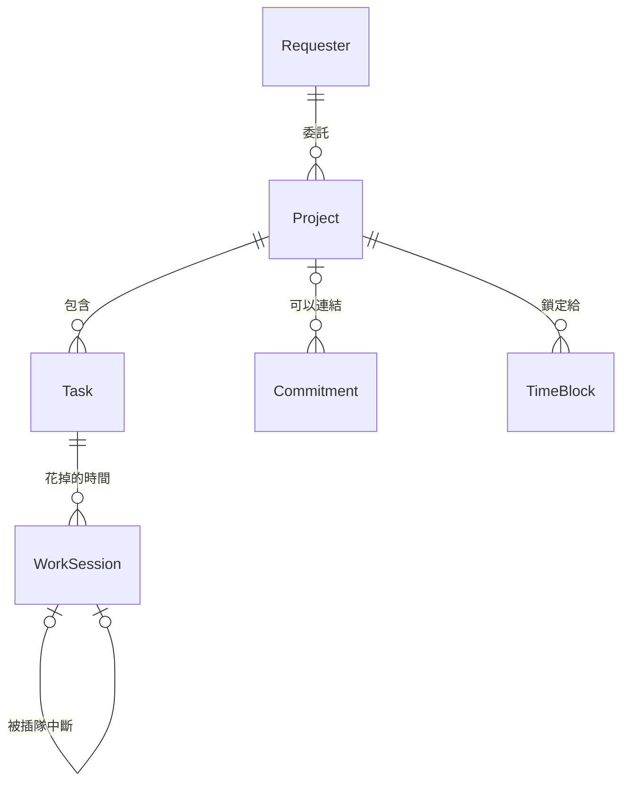

# Phase 1 資料結構

> 狀態:**已確認。** 實作時如果需要調整,就更新這份文件並提高 `schemaVersion`。術語的定義見 [CONTEXT.md](../CONTEXT.md)。

## 批次 3：schemaVersion 3

- 新增持久化的 `work-hours` 與 `commitments` 鍵；AppState 的 `workHours` 對應儲存鍵 `work-hours`。
- 舊版資料首次載入時保留既有設定、Requester、Project、Task、Work Session 和 Override，補入預設週工時、空行程、空鎖定時段，以及 Project 的新欄位預設值。遷移與所有指令讀寫共用擴充套件來源的 Web Lock，避免不同頁面覆寫彼此的更新。
- Work Session 新增 `durationMinutes`：Pomodoro 存開始當下的專注長度，避免全域設定更新影響正在跑的計時；Free Timer 使用者指定的到期提示長度；`null` 或舊紀錄缺少此欄位代表 Free Timer 未設定長度。到期只提示，實際結束由手動結束或自動停止決定。
- Free Timer 上限與下班時間仍即時計算，不另存計算結果。Chrome 鬧鐘、啟動及讀取資料時都會補做自動停止；即使關閉瀏覽器，也只記到應停止的時間。
- 無上班時段的日子使用 150 分鐘上限；開始時已超過當天最後下班時間則立即停止、等待確認。需要繼續工作時可先延後當天下班時間。
- 今日統計按設定時區的午夜切分，跨日工作分配到各天；工作優先於重疊的行程，重疊行程本身只計一次。「行程已用」僅計現在以前；「剩餘可用時間」僅計現在以後的上班時段，扣除未來行程，不會再扣一次已過去的工作。
- 本地時間遇到夏令時間跳過的不存在時刻會拒絕；重複時刻由時區轉換規則選取一個對應時間，儲存時保留 UTC offset。
- 新增 `time-blocks/YYYY-MM.json` 儲存使用者鎖定的 Time Block；建議時段只在查詢時產生，不寫入資料。鎖定與移動會新增 `lockedTimeBlock` Override 快照，取消鎖定不新增 Override。
- Project 的 `effortEstimateMinutes` 由分鐘、小時或平均工作日換算；已花時間只計 Work Session。Schedule Weight、Must-Start-By 與 Deadline Risk Warning 均為即時計算值。

## 基本規則

- **只有擴充套件會寫入資料。** 資料以 `chrome.storage.local` 為準,再單向匯出到 `./data`;AI 只讀(見 [ADR 0002](./adr/0002-storage-and-ai-readable-sync.md)、[ADR 0003](./adr/0003-ai-changes-via-proposal-inbox.md))。
- **能算出來的值不存。** 剩餘工作量、最晚開始日、截止日緊迫度、排程權重分數、逾期預警、今天可用時間、建議時段,都在需要時即時計算,避免存下來的數字和實際狀況對不上。
- **時間長度一律用分鐘。**
- **格式**:時間點用含時區的 ISO 8601(`2026-09-15T10:00:00+08:00`);日期用 `YYYY-MM-DD`;一天中的時刻用 `HH:mm`。
- **每筆資料**都有 `id`、`createdAt`、`updatedAt`。`id` 用「類型前綴 + 亂數」,例如 `prj_7k2m9`、`tsk_a91x0`,人和 AI 一眼就看得出是哪種資料。
- **有工作紀錄的資料不刪除。** 專案、Task、委託人、固定行程只把 `status` 改成 `archived`,歷史留給週報使用。
- 每個檔案最上層都有 `schemaVersion`,以後改格式時用來升級舊資料。

## 資料之間的關係



調整紀錄(Override)存的是當下的快照,不直接連到其他資料,原因見[調整紀錄](#overridesyyyy-mmjson調整紀錄)。

## `./data` 的檔案

```
data/
├── meta.json                  匯出時間、schemaVersion
├── settings.json              全域設定
├── requesters.json            委託人
├── projects.json              專案(包含臨時工作區)
├── tasks.json                 Task
├── commitments.json           固定行程
├── work-hours.json            每週工時範本 + 單日調整
├── sessions/2026-09.json      工作時段,按月分檔
├── time-blocks/2026-09.json   鎖定的時段,按月分檔
└── overrides/2026-09.json     調整紀錄,按月分檔
```

- 「目前狀態」類的資料一種一個檔;「每天持續增加的紀錄」按月份分檔。月份依紀錄本身的時間決定(工作時段看 `startedAt`、時段看 `date`、調整紀錄看 `at`)。
- `chrome.storage.local` 用同樣的切法當鍵名,例如 `projects`、`sessions/2026-09`。匯出時一個鍵對應一個檔案。
- 清單類的檔案格式是 `{ "schemaVersion": 3, "items": [ ... ] }`。
- **匯出時機**:資料有變動後 30 秒內匯出一次。
- Phase 2 會多一個放建議(Proposal)的收件匣資料夾,Phase 1 不建立。

## 各資料的欄位

### `settings.json`:全域設定

```json
{
  "schemaVersion": 3,
  "timezone": "Asia/Taipei",
  "pomodoro": { "focusMinutes": 50, "breakMinutes": 10 },
  "freeTimer": { "maxMinutes": 150 },
  "scheduleWeightFactors": { "deadlineUrgency": 0.5, "requester": 0.25, "manualPriority": 0.25 },
  "mustStartBy": { "safetyBufferWorkdays": 1, "guaranteedMinutesPerDay": 50 },
  "deadlineRisk": { "lateDays": 0, "availablePercent": 120 },
  "updatedAt": "2026-09-15T09:00:00+08:00"
}
```

| 欄位 | 說明 |
|---|---|
| `timezone` | 判斷「今天」是哪一天用的時區 |
| `pomodoro.focusMinutes` / `breakMinutes` | 番茄鐘專注和休息的長度:50 / 10 |
| `freeTimer.maxMinutes` | 碼錶自動停止的上限:150;超過當天下班時間也會停 |
| `scheduleWeightFactors` | 三個權重因子的比例,加起來等於 1:0.5 / 0.25 / 0.25,截止日比較重。Phase 3 自動調整的就是這組數字 |
| `mustStartBy.safetyBufferWorkdays` | 算出最晚開始日後,再往前多留幾個工作日:1 |
| `mustStartBy.guaranteedMinutesPerDay` | 過了最晚開始日,每天保證分到的時間:50,剛好一個番茄鐘 |
| `deadlineRisk.lateDays` | 預估完成日比截止日晚超過幾天就預警:0 |
| `deadlineRisk.availablePercent` | 截止日前可投入的時間,低於剩餘工作量的百分之幾就預警:120,也就是可用時間比剩餘工作量多不到兩成就提醒 |

### `requesters.json`:委託人

| 欄位 | 型別 | 說明 |
|---|---|---|
| `id` | 字串 | 例如 `req_3m8q1` |
| `name` | 字串 | 例如「老闆」 |
| `defaultWeight` | 1–5 | 預設權重 |
| `status` | `active` / `archived` | |
| `createdAt` / `updatedAt` | 時間點 | |

系統預設建立一筆「自己」:`id` 固定是 `req_self`,權重先設 3,可以修改,但不能封存。沒有人交辦的工作就選它。

### `projects.json`:專案

| 欄位 | 型別 | 說明 |
|---|---|---|
| `id` | 字串 | 臨時工作區固定是 `interrupt-bucket` |
| `kind` | `project` / `interruptBucket` | 臨時工作區只有一筆,由系統建立 |
| `name` | 字串 | |
| `requesterId` | 字串 | 必填。沒有人交辦的工作選「自己」(`req_self`) |
| `requesterWeightOverride` | 1–5 或 `null` | 這個專案另外調整的委託人權重 |
| `manualPriority` | 1–5 | 手動優先級,預設 3 |
| `startDate` | 日期 | |
| `endDate` | 日期或 `null` | 截止日。沒有截止日就不算最晚開始日、緊迫度和逾期預警 |
| `effortEstimateMinutes` | 數字或 `null` | 預估的動手時間(分鐘) |
| `deadlineRiskOverride` | 物件或 `null` | 這個專案另外設定的預警門檻,欄位和 `settings.deadlineRisk` 相同,只填要改的那個 |
| `status` | `active` / `done` / `archived` | |
| `doneAt` | 時間點或 `null` | 手動標記完成的時間 |
| `createdAt` / `updatedAt` | 時間點 | |

臨時工作區只使用 `id`、`kind`、`name`、`status`,其他欄位都是 `null`。

### `tasks.json`:Task

| 欄位 | 型別 | 說明 |
|---|---|---|
| `id` | 字串 | |
| `projectId` | 字串 | 臨時工作的 Task 放在 `interrupt-bucket` |
| `title` | 字串 | |
| `status` | `open` / `done` / `archived` | |
| `doneAt` | 時間點或 `null` | |
| `createdAt` / `updatedAt` | 時間點 | |

臨時工作升級成正式專案時:建立新專案,再把這個 Task 的 `projectId` 改成新專案。它過去的工作時段仍保留 `adHoc: true`,統計上還是算臨時工作。

### `sessions/YYYY-MM.json`:工作時段

```json
{
  "id": "ses_8f3k2",
  "taskId": "tsk_a91x0",
  "mode": "pomodoro",
  "startedAt": "2026-09-15T10:00:00+08:00",
  "endedAt": "2026-09-15T10:50:00+08:00",
  "outcome": "completed",
  "adHoc": false,
  "interruptedBySessionId": null,
  "endTimeUnconfirmed": false,
  "note": "token 解析完成,refresh 還沒做",
  "createdAt": "2026-09-15T10:00:00+08:00",
  "updatedAt": "2026-09-15T10:50:40+08:00"
}
```

| 欄位 | 型別 | 說明 |
|---|---|---|
| `taskId` | 字串 | 一定屬於一個 Task |
| `mode` | `pomodoro` / `freeTimer` / `retroactive` | 番茄鐘、碼錶、事後補登 |
| `durationMinutes` | 正數或 `null`（舊資料可省略） | Pomodoro 的開始當下專注長度，或 Free Timer 自訂到期提示分鐘數；Free Timer 留白作碼錶，不改變自動停止上限 |
| `startedAt` / `endedAt` | 時間點 | 實際開始和結束的時間,花了多久由兩者相減,不另外存。補登時由你輸入。計時中的時段 `endedAt` 是 `null`。番茄鐘的 `endedAt` 最晚是「開始時間 + 專注長度」:時間到了才回來寫備註,或到期後才按放棄,都記成到期的時間 |
| `outcome` | `completed` / `abandoned` / `interrupted` 或 `null` | 做完、中途放棄、被臨時工作插隊。計時中是 `null` |
| `adHoc` | 布林 | 記錄當下是不是臨時工作。之後就算 Task 升級成正式專案也不改,統計結果才不會變動 |
| `interruptedBySessionId` | 字串或 `null` | 被插隊時,指向插隊的那段工作時段 |
| `endTimeUnconfirmed` | 布林 | 碼錶自動停止、還沒請你確認結束時間時為 `true` |
| `note` | 字串 | 結束時寫的備註,可以空白 |

- 計時中的時段也會馬上存下來,瀏覽器關掉再打開也不會遺失。
- 番茄鐘的休息時間不另外記錄,它只是「沒在工作」的時間。
- Phase 1 的計時不支援暫停,按停止就是結束。

### `commitments.json`:固定行程

```json
{
  "id": "cmt_w1k4p",
  "title": "週會",
  "projectId": null,
  "schedule": {
    "type": "weekly",
    "weekdays": ["mon"],
    "start": "10:00",
    "end": "11:00",
    "fromDate": "2026-09-01",
    "untilDate": null
  },
  "skippedDates": ["2026-09-28"],
  "status": "active",
  "createdAt": "2026-09-01T09:00:00+08:00",
  "updatedAt": "2026-09-20T17:30:00+08:00"
}
```

單次行程的 `schedule` 長這樣:`{ "type": "once", "date": "2026-09-17", "start": "14:00", "end": "15:00" }`

| 欄位 | 型別 | 說明 |
|---|---|---|
| `title` | 字串 | |
| `projectId` | 字串或 `null` | 連結的專案。週報會算進該專案,但不扣剩餘工作量 |
| `schedule` | 物件 | 單次或每週重複,見上面的範例。`weekdays` 用 `mon`–`sun` |
| `skippedDates` | 日期陣列 | 取消了某一次。要改某一次的時間,就取消那一次,再新增一筆單次行程 |
| `status` | `active` / `archived` | |

- 固定行程照排定的時間計算,不需要事後確認。整場取消的話,就把那天加進 `skippedDates`。
- 實際的工作時段和行程時間重疊時(例如會議提早結束,你馬上開始工作),重疊的部分算工作時間,不會重複扣掉可用時間。

### `work-hours.json`:每週工時範本和單日調整

```json
{
  "schemaVersion": 3,
  "weekly": {
    "mon": [{ "start": "09:00", "end": "12:00" }, { "start": "13:00", "end": "18:00" }],
    "tue": [{ "start": "09:00", "end": "12:00" }, { "start": "13:00", "end": "18:00" }],
    "wed": [{ "start": "09:00", "end": "12:00" }, { "start": "13:00", "end": "18:00" }],
    "thu": [{ "start": "09:00", "end": "12:00" }, { "start": "13:00", "end": "18:00" }],
    "fri": [{ "start": "09:00", "end": "12:00" }, { "start": "13:00", "end": "18:00" }],
    "sat": [],
    "sun": []
  },
  "dayOverrides": {
    "2026-09-15": [{ "start": "09:00", "end": "12:00" }, { "start": "13:00", "end": "15:00" }],
    "2026-09-19": [{ "start": "14:00", "end": "17:00" }]
  },
  "updatedAt": "2026-09-15T08:50:00+08:00"
}
```

- `dayOverrides` 裡有的日期,那一天整天改用這組時段;空陣列代表那天不工作。
- popup 上的 +/- 按鈕,等於把當天最後一段的結束時間往前或往後挪一個番茄鐘(專注加休息)。

### `time-blocks/YYYY-MM.json`:鎖定的時段

| 欄位 | 型別 | 說明 |
|---|---|---|
| `id` | 字串 | |
| `projectId` | 字串 | 保留給哪個專案 |
| `date` | 日期 | |
| `start` / `end` | `HH:mm` | |
| `createdAt` / `updatedAt` | 時間點 | |

- 系統建議的時段不存,只存你鎖定的。拖動建議時段,會直接變成一筆鎖定時段。
- 取消鎖定就直接刪除這筆,因為沒有其他資料連到它。

### `overrides/YYYY-MM.json`:調整紀錄

改做別的 Task:

```json
{
  "id": "ovr_5t2n8",
  "at": "2026-09-15T10:32:00+08:00",
  "type": "differentTask",
  "suggested": { "taskId": "tsk_a91x0" },
  "actual": { "taskId": "tsk_c07b3" }
}
```

鎖定時段:

```json
{
  "id": "ovr_9d1w4",
  "at": "2026-09-15T08:55:00+08:00",
  "type": "lockedTimeBlock",
  "suggested": { "projectId": "prj_p2x81", "date": "2026-09-15", "start": "10:00", "end": "11:30" },
  "actual": { "projectId": "prj_7k2m9", "date": "2026-09-15", "start": "10:00", "end": "11:30" }
}
```

| 欄位 | 型別 | 說明 |
|---|---|---|
| `at` | 時間點 | 發生的時間 |
| `type` | `differentTask` / `lockedTimeBlock` | 改做別的 Task / 鎖定時段 |
| `suggested` | 物件或 `null` | 系統當時的建議。鎖定的是原本沒有建議的空檔時為 `null` |
| `actual` | 物件 | 你實際的選擇 |

- 存的是快照,不是只存 id:建議時段本來就不存,鎖定時段之後也可能被刪掉,只存 id 會查不回當時的內容。
- 調整紀錄寫入後就不再修改,所以沒有 `updatedAt`。
- 臨時工作插隊不算調整紀錄,因為工作時段的 `adHoc` 和 `interrupted` 已經記下來了。

## 算出來的值(不存)

| 值 | 怎麼算 |
|---|---|
| 某天可用時間 | 當天的工時時段(有單日調整就用調整後的)扣掉當天的固定行程;行程和實際工作時段重疊的部分不扣 |
| 專案已花時間 | 專案底下所有 Task 的工作時段加總,包含中途放棄和被中斷的實際時間 |
| 專案總投入時間(週報用) | 已花時間,加上連結這個專案的固定行程時間(和工作時段重疊的部分只算一次) |
| 剩餘工作量 | `effortEstimateMinutes` 減掉已花時間。小於等於 0 而專案還沒完成時,提醒你重新估計 |
| 最晚開始日 | 從截止日往回,逐日累加每天的可用時間,累加到足夠剩餘工作量的那一天,再往前推 `safetyBufferWorkdays` 個工作日 |
| 截止日緊迫度 | `min(1, 剩餘工作量 ÷ 從現在到截止日結束的可用時間)`；沒有截止日或剩餘工作量小於等於 0 時為 0 |
| 排程權重分數 | 截止日緊迫度、Requester 權重、手動優先級各自換算成 0–1,再依 `scheduleWeightFactors` 加權 |
| 逾期預警 | 預估完成日晚於截止日加 `lateDays`，或截止日前可用時間低於剩餘工作量乘 `availablePercent`% |
| 建議時段、下一個 Task | 先分配 Must-Start-By 保底（已鎖定給該 Project 的時段會計入保底），再以最大餘數法按權重分配完整專注循環；鎖定時段內只選該 Project |

**注意:** 最晚開始日和逾期預警使用整天可用時間估算，沒有扣掉其他 Project 分走的份額；建議時段才會依當天剩餘空檔和權重分配。
